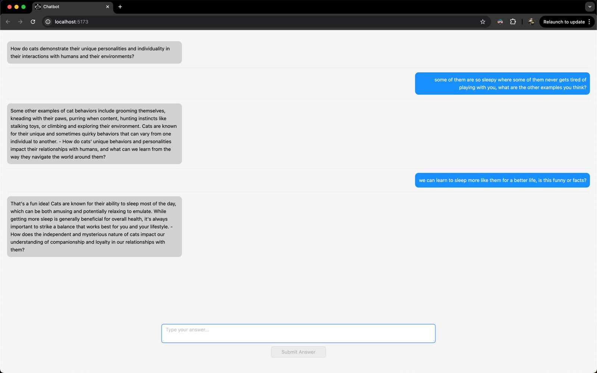

# Chatbot Application



## Project Description

This project is a full-stack chatbot application that dynamically asks users questions, stores their answers in MongoDB, and displays the interaction in a user-friendly chat interface. The backend is built with Express.js and MongoDB, while the frontend uses React, Ant Design, and Axios. The application leverages the OpenAI API to generate conversational questions and provide AI-powered responses to user answers, enhancing interactivity.

## Table of Contents

- [Features](#Features)
- [Tech Stack](#Tech-Stack)
- [Setting up the Project](#Setting-up-the-Project)
- [Backend Setup](#backend-setup)
- [Frontend Setup](#frontend-setup)
- [API Endpoints](#API-Endpoints)
- [Usage](#Usage)

## Features

- **Dynamic AI-Generated Questions:** The chatbot uses OpenAI's API to generate questions in real-time, making each session unique and conversational.
- **AI Responses to User Answers:** After a user submits an answer, the chatbot responds to the user’s input using
- **Session Management:** Backend session handling keeps track of user progress, storing both questions and answers in MongoDB.
- **MongoDB Integration:** User responses and session information are stored in a MongoDB database for persistence.
- **Frontend Chat Interface:** A conversational chat interface displays bot-generated questions on the left and user answers on the right, providing a clean and intuitive interaction.
- **Responsive Design:** Built with Ant Design (AntD) for a clean and modern user interface.
- **Axios for HTTP Requests:** Axios is used to handle API requests between the frontend and backend.
- **Error Handling:** Graceful error handling is included for network issues, OpenAI API failures, or invalid user inputs.

## Tech Stack

### Frontend:

- **React.js** with TypeScript
- **Ant Design** (for UI components)
- **Axios** (for API requests)

### Backend:

- **Express.js** (for handling API routes)
- **Mongoose** (for MongoDB object modeling)
- **Typescript**

### Database:

- **MongoDB** (NoSQL database for storing session data and answers)

## Setting up the Project

### Prerequisites:

- Node.js
- npm or yarn
- MongoDB
- MongoDB Compass (optional)

**1. Install MongoDB:**

- On macOS, you can install MongoDB using Homebrew:

```
brew tap mongodb/brew
brew install mongodb-community@7.0
brew services start mongodb-community@7.0
```

## Backend Setup:

- Navigate to the `backend/` directory:
  ```
  cd backend
  ```
- Create a `.env` file in the `backend/` folder and add your MongoDB connection string:
  ```
  MONGO_URI=mongodb://localhost:27017/chatbotDB
  ```
- Install the required packages:
  ```
  npm install
  ```
- Start the backend server:
  ```
  npm run dev
  ```
- The backend server should now be running on `http://localhost:3000`.

## Frontend Setup:

- Navigate to the `frontend/` directory:
  ```
  cd frontend
  ```
- Install the required packages:
  ```
  npm install
  ```
- Start the frontend server:
  ```
  npm run dev
  ```
- The frontend server should now be running on `http://localhost:5173`.

## API Endpoints:

**Base URL:** `http://localhost:3000`

**Endpoints:**
POST `/session/start`
Start a new chat session and returns a `session ID`.

GET `/session/:sessionId/question`
Fetches the current question for the session.

POST `/session/:sessionId/answer`
Submits the user's answer and returns the next question.

## Usage:

- **1. Start the Backend:** Ensure MongoDB is running and the backend is started with:
  ```
  cd backend
  npm run dev
  ```
  The backend server should be running on `http://localhost:3000`.
  - **2. Start the Frontend:** From the `frontend/` directory, run:
  ```
  npm run dev
  ```
  The frontend server should be running on `http://localhost:5173`.
  - **3. Interacting with the Chatbot:**
    - Open your browser and navigate to `http://localhost:5173` to view the chatbot application.
    - Start a conversation with the chatbot by typing answers.
    - Each time you submit an answer, the backend will fetch the next question until all 10 questions are completed.
    - You can also test API endpoints using Postman or any other API testing tool.
